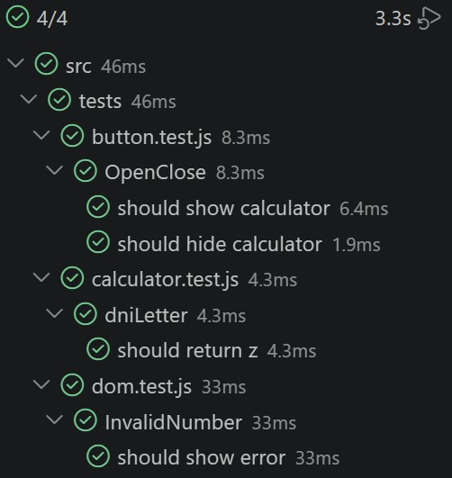

# kata-dni-simoneaa

## Descripción

Este proyecto consistía en la creación de un programa con el que calcular la letra del DNI empleando el siguiente algoritmo:  

- Introduciendo un número entre el 0 y el 99999999
- Se divide el número entre 23 y tomamos el resto de la operación
- Según el resultado le corresponderá una de las letras siguientes: T R W A G M Y F P D X B N J Z S Q V H L C K E

## Criterios

El trabajo debía realizarse teniendo en cuenta los siguientes criterios de aceptación

*Scenario: Iniciar el sistema*  
  Given que el usuario está en la página para iniciar la aplicación  
  When hace click en el botón iniciar  
  Then el botón desaparecerá y se le solicitará el número para realizar el cálculo  

*Scenario: DNI válido*  
   Given que introduzco un número entre 0 y 99999999  
   When calculo la letra del DNI  
   Then debe devolverse la letra correspondiente según el módulo 23  

*Scenario: Número fuera de rango*  
    Given que introduzco un número menor que 0 o mayor que 99999999  
    When intento calcular la letra  
    Then debe mostrarse el mensaje "El dato introducido es incorrecto"  

*Scenario: Dato no numérico*  
    Given que introduzco un valor que no es un número  
    When intento calcular la letra  
    Then debe mostrarse el mensaje "el dato introducido es incorrecto"  

*Scenario: Repetición del proceso*  
    Given que el usuario no pulsa cancelar  
    When finaliza un cálculo  
    Then debe volver a solicitar un nuevo número  

*Scenario: Cancelación del proceso*  
    Given que el usuario pulsa cancelar  
    When se detecta la cancelación  
    Then el programa debe finalizar  

## Coding

La lógica del programa está dividida en 4 archivos de Javascript.

1. **button.js**

Esta función se ocupa de mostrar y ocultar el formulario en el que se introduce el número para realizar el cálculo al pulsar los botones de iniciar y cancelar, respectivamente.  
"OpenTest" cambia el display del div que contiene la pantalla de inicio y el formulario a "none" y "flex", respectivamente, mientras que "CloseTest" hace lo contrario. La función "init" agrupa ambas anteriores y las enlaza al DOM mediante un "addEventListener".

```export function openTest() {
    document.getElementById("calculator").style.display = "flex";
    document.getElementById("button-call").style.display = "none";
}

export function closeTest() {
    document.getElementById("calculator").style.display = "none";
    document.getElementById("button-call").style.display = "block";
}

export function init() {
    document.getElementById("calculator").style.display = "none";
    document.getElementById('button-call').addEventListener('click', openTest);
    document.getElementById('cancel-button').addEventListener('click', closeTest);
}
```  

2. **calculator.js**

Aquí se contiene la lógica de la operación matemática. La constante "letterList" es la lista de letras en el orden correcto, mientras que la función "dniLetter" transforma el dato introducido en un número y lo divide entre 23, utilizando el resto junto a un "charAt" para encontrar la posición en la lista.

```const letterList = "TRWAGMYFPDXBNJZSQVHLCKE";

export function dniLetter(numero) {
    let numbResult = parseInt(numero) % 23;
    return letterList.charAt(numbResult);
}
```

3. **dom.js**

Esta imprime los datos de "calculator.js" en pantalla.  
Utiliza el button y el input para obtener los datos, y tras asegurarse de que el dato introducido es correcto mediante el "if", cuyas partes detectan si no es un número, si es menor que 0 o si es mayor que 99999999, respectivamente, devuelve un mensaje con el resultado a través de "dniLetter" importado del .js anterior.

```import { dniLetter } from "./calculator.js";
import { showResult, hideResult } from "./message.js";

export function initCalculator() {
    const numbInput = document.getElementById("number-form");
    const calculateButton = document.getElementById("calculate-button");

    calculateButton.addEventListener("click", function () {

        const numero = parseInt(numbInput.value);

        if (isNaN(numero) || numero < 0 || numero > 99999999) {
            showResult("El dato introducido es incorrecto");
            numbInput.focus();
            return;
        }

        const letra = dniLetter(numbInput.value);
        showResult(`La letra de tu DNI es ${letra}`);
    });
}
```

4. **message.js**

La última función muestra y oculta el mensaje de resultado de manera similar a la que la primera muestra y oculta inicio y formulario, y está importada dentro de "dom.js".

```export function showResult(message) {
    const resultMessage = document.getElementById("result-message");
    resultMessage.textContent = message;
    resultMessage.style.display = "block";
}

export function hideResult() {
    const resultMessage = document.getElementById("result-message");
    resultMessage.textContent = "";
    resultMessage.style.display = "none";
}
```

## Testing



## Autora

Simone Ávila Arranz